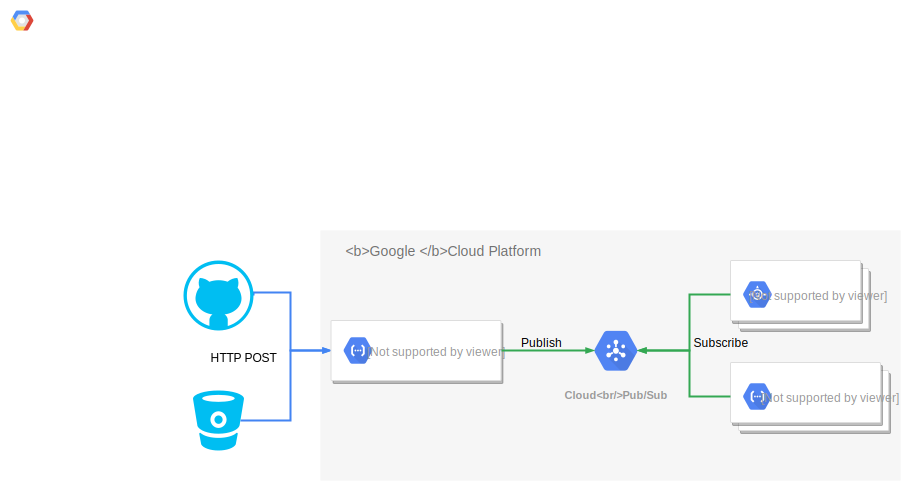

# pubsub-webhook


Convert webhooks requests to PubSub messages.

This is a Google Cloud Function that takes an incoming HTTP POST payload and forwards it to a Pub/Sub topic. That's it. It's particularly useful if you want to serve a single webhook on Google Cloud and have it trigger multiple subscribers, whether it be Cloud Functions or App Engine applications, or anything else subscribing to the topic.



## Requirements

* Google Cloud

## Installation

Set some environment variables first:

* `GOOGLE_CLOUD_PROJECT`: the project in which to deploy the function
* `TOPIC_NAME`: the Pub/Sub topic to which to forward the POST payloads
* `TOPIC_PROJECT`: (optional) the project hosting the Pub/Sub topic; the default is the same project as the function
* `IP_WHITELIST`: (optional) comma delimited list of IP ranges from which the HTTP POST must originate, e.g. `1.2.3.4/32,1.2.3.5/24`; defaults to allowing all requests

### Create Topic

Create a Cloud Pub/Sub topic:

```bash
gcloud pubsub topics create $TOPIC_NAME
```

### Configure IAM

Create a new service account for use by the Cloud Function:

```bash
gcloud iam service-accounts create webhook
```

Grant permissions to publish to the topic:

```bash
gcloud pubsub topics add-iam-policy-binding $TOPIC_NAME \
    --member "serviceAccount:webhook@${GOOGLE_CLOUD_PROJECT}.iam.gserviceaccount.com" \
    --role roles/pubsub.publisher \
    --project $TOPIC_PROJECT
```

### Deploy

```bash
gcloud beta functions deploy webhook \
     --source . \
     --runtime python37 \
     --entry-point pubsub_webhook \
     --service-account webhook@${GOOGLE_CLOUD_PROJECT}.iam.gserviceaccount.com \
     --set-env-vars TOPIC_NAME=${TOPIC_NAME},TOPIC_PROJECT=${TOPIC_PROJECT},IP_WHITELIST=${IP_WHITELIST} \
     --trigger-http \
     --allow-unauthenticated
```

### Test

Run an integration test against a deployed function:

```bash
make integration
```

Ensure you've set the environment variable `TOPIC_NAME` first.
